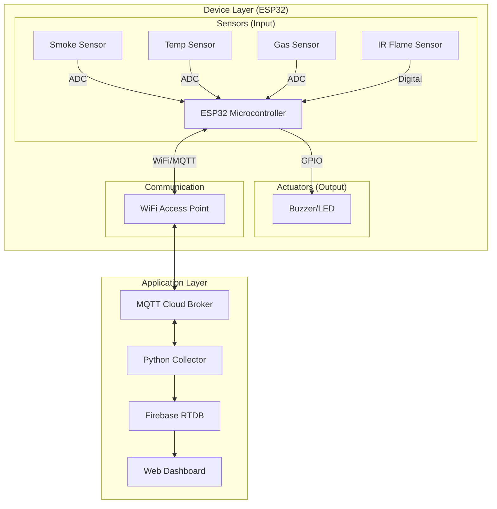

# BÁO CÁO ĐỒ ÁN: HỆ THỐNG BÁO CHÁY THỜI GIAN THỰC (RTS PROJECT)

## 1. TỔNG QUAN (INTRODUCTION)

### 1.1. Giới thiệu chung
Hệ thống báo cháy thời gian thực (Real-Time Fire Alarm System) là một giải pháp IoT toàn diện, kết hợp sức mạnh xử lý tại biên (Edge Computing) của vi điều khiển ESP32 với khả năng giám sát và đo lường hiệu năng trên Application Server.

Dự án được thiết kế để giải quyết bài toán cốt lõi của các hệ thống an toàn: **Độ trễ thấp (Low Latency)** và **Độ tin cậy cao (High Reliability)**. Khi phát hiện nguy cơ cháy (Khói, Nhiệt, Lửa hoặc Gas), hệ thống phải phản hồi tức thì bằng còi báo động tại chỗ, đồng thời gửi tin nhắn cảnh báo khẩn cấp (Emergency Alert) đến máy chủ với sự đảm bảo tuyệt đối về khả năng truyền tin.

### 1.2. Kiến trúc hệ thống
Hệ thống bao gồm hai thành phần chính:
1.  **Device Layer (Firmware):** Chạy trên ESP32, sử dụng hệ điều hành thời gian thực **FreeRTOS** trong môi trường **ESP-IDF v5.5.1**.
2.  **Application Layer (Server & Benchmark):** Server thu thập dữ liệu viết bằng Python, tích hợp công cụ đo đạc độ trễ End-to-End và lưu trữ trạng thái thời gian thực lên Firebase.

### 1.3. Kiến trúc Phần cứng (Hardware Architecture)
#### Sơ đồ khối (Block Diagram)
Hệ thống bao gồm các khối chức năng chính:
1.  **Khối Cảm biến (Input):** Thu thập dữ liệu môi trường (Khói, Nhiệt, Gas, Lửa).
2.  **Khối Xử lý trung tâm (ESP32):** Đọc cảm biến, xử lý logic phát hiện cháy và điều khiển cảnh báo.
3.  **Khối Chấp hành (Output):** Buzzer và LED cảnh báo.
4.  **Khối Truyền thông:** Module WiFi gửi dữ liệu lên MQTT Broker.



#### Bảng kết nối I/O (Hardware Mapping)
Chi tiết kết nối các thiết bị ngoại vi với vi điều khiển ESP32:

| Component | ESP32 Pin | Signal Type | Description |
| :--- | :--- | :--- | :--- |
| **Buzzer** | GPIO 25 | Output (Dig) | Còi báo động Active High |
| **Smoke Sensor** | GPIO 34 | Input (ADC) | Cảm biến khói MQ-2 |
| **Temp Sensor** | GPIO 35 | Input (ADC) | Cảm biến nhiệt LM35 |
| **Gas Sensor** | GPIO 33 | Input (ADC) | Cảm biến Gas MQ-5 |
| **IR Flame** | GPIO 32 | Input (Dig) | Cảm biến phát hiện lửa |

## 2. PHÂN TÍCH & LẬP LỊCH (REAL-TIME SCHEDULING)

Dự án sử dụng **FreeRTOS** làm nhân hệ điều hành để quản lý đa nhiệm trên vi điều khiển ESP32. Việc phân chia Task và gán Priority được thực hiện cẩn thận để đảm bảo tính chất "Hard Real-time" của tác vụ cảnh báo.

### 2.1. Mô hình Task (Task Model)
Dựa trên source code `main.c`, hệ thống được chia thành các tác vụ (Tasks) sau, được sắp xếp theo thứ tự ưu tiên từ cao xuống thấp:

| Task Name | Priority | Stack | Vai Trò & Đặc Tả |
| :--- | :--- | :--- | :--- |
| **Warning Task** | High (MAX-1) | 4096 | **Hard Real-time:** Kiểm tra trạng thái cháy liên tục. Yêu cầu phản hồi tức thì để kích hoạt Buzzer và Alert. |
| **Sensor Task** | High (MAX-1) | 4096 | **Hard Real-time:** Đọc cảm biến (Smoke, Temp...) chu kỳ 500ms. Đầu vào cho Warning Task. |
| **Buzzer Task** | High (MAX-2) | 2048 | Điều khiển còi/LED. Priority cao để không bị ngắt bởi tác vụ mạng. |
| **MQTT Sensor** | Med (MAX-3) | 4096 | Gửi Telemetry chu kỳ 5s (Soft Real-time). |
| **MQTT Control** | Med (MAX-3) | 4096 | Xử lý lệnh điều khiển từ Server. |
| **MQTT Task** | Low (MAX-4) | 4096 | Duy trì kết nối Keep-alive, xử lý TCP/IP. |

> *Note:* `configMAX_PRIORITIES` thường là 25. Việc đặt Sensor và Warning task ở mức cao nhất đảm bảo chúng luôn chiếm quyền CPU (Preempt) ngay khi có sự kiện.

### 2.2. Cơ chế Lập lịch (Scheduling Mechanism)
Hệ thống sử dụng cơ chế **Preemptive Priority Scheduling** của FreeRTOS:
-   **Preemption (Chiếm quyền):** Nếu `Warning Task` đang chờ (Blocked) và bất ngờ nhận được tín hiệu cháy từ `Sensor Task`, nó sẽ lập tức chiếm quyền CPU từ `MQTT Task` đang chạy. Điều này đảm bảo độ trễ xử lý là cực tiểu (Microseconds level).
-   **Time Slicing:** Các Task cùng độ ưu tiên sẽ được chia sẻ thời gian CPU (Round Robin).

## 3. TRUYỀN THÔNG & CƠ SỞ DỮ LIỆU

### 3.1. Truyền thông thời gian thực (Real-Time Communication)
Giao tiếp giữa Device và Server sử dụng giao thức **MQTT** qua WiFi. Đây là giao thức nhẹ, phù hợp cho IoT nhưng được tinh chỉnh cấu hình QoS để đáp ứng yêu cầu thời gian thực khác nhau.

#### Chiến lược QoS (Quality of Service)
Hệ thống áp dụng chiến lược QoS phân tầng:

1.  **Telemetry (Dữ liệu định kỳ):**
    -   **QoS:** 0 hoặc 1.
    -   **Mục tiêu:** Tối ưu hóa băng thông. Chấp nhận mất gói tin định kỳ (5s/lần) để giảm tải.
2.  **Emergency Alert (Báo cháy):**
    -   **QoS 2 (Exactly Once):** Bắt buộc.
    -   **Phân tích:** Hàm `mqtt_publish_alert` trong `mqtt.c` sử dụng `MQTT_QOS_2`.
    -   **Mục tiêu:** Đảm bảo **tuyệt đối** bản tin báo cháy đến Server đúng 1 lần duy nhất, không mất mát, không trùng lặp.

#### Cấu trúc dữ liệu
Dữ liệu được đóng gói dạng JSON. Ví dụ gói tin Alert (QoS 2):

```json
{
  "type": "fire_alert",
  "detected": true,
  "timestamp": 1704938210.123,
  "smoke": 85.5,
  "temperature": 60.2,
  "ir_flame": true,
  "gas": 120
}
```

### 3.2. Cơ sở dữ liệu thời gian thực (Real-Time Database)
Server sử dụng **Firebase Realtime Database** làm kho lưu trữ nóng.
-   **Cập nhật trạng thái:** Node `/devices/{id}/state` được cập nhật ngay khi nhận telemetry.
-   **Lưu sự kiện:** Node `/alarms/{id}` lưu lịch sử báo cháy.
-   **Data Freshness:** Web Dashboard lắng nghe trực tiếp Firebase, phản ánh trạng thái "Live" với độ trễ thấp.

## 4. THỰC THI & ĐÁNH GIÁ HIỆU NĂNG

### 4.1. Kiến trúc đo đạc (Measurement Pipeline)
Luồng dữ liệu để đo đạc hiệu năng:
$$ Sensor (t_1) \rightarrow MQTT Broker \rightarrow Python Collector (t_2) \rightarrow SQLite/CSV $$

File `collector_main.py` đóng vai trò trung tâm đo đạc với lớp `TraceWriter`.

### 4.2. Các chỉ số đánh giá (Metrics)
#### End-to-End Latency (Độ trễ toàn trình)
Công thức:
$$ \Delta t = t_{PC\_RX} - t_{Sensor} $$
Trong đó:
-   $t_{Sensor}$: Thời gian đóng gói tại ESP32 (`msg.t_sensor_ms`).
-   $t_{PC\_RX}$: Thời gian Python Server nhận gói tin.

Chỉ số này phản ánh tổng độ trễ của: Xử lý tại ESP32 + Truyền WiFi + Broker Forwarding + Xử lý Server.

#### Jitter (Độ rung)
Phân tích từ file log `trace_events.csv`. Đo độ biến thiên của hiệu số thời gian giữa các gói tin liên tiếp. Jitter thấp chứng tỏ kết nối mạng và khả năng lập lịch ổn định.

### 4.3. Stress Test
Sử dụng script giả lập hàng trăm Sensor cùng lúc gửi dữ liệu báo cháy về Server để tìm điểm nghẽn (Bottleneck).
**Kết quả mong đợi:** Hệ thống vẫn nhận diện được gói tin Alert (QoS 2) ưu tiên ngay cả khi băng thông bị nghẽn bởi các gói tin Telemetry (QoS 0).

## KẾT LUẬN

Hệ thống báo cháy đã hiện thực hóa thành công mô hình Real-Time Systems tiêu chuẩn:
1.  **Về lập lịch:** Sử dụng đúng đắn FreeRTOS Preemptive Scheduling, ưu tiên tuyệt đối cho tác vụ an toàn (Safety).
2.  **Về truyền thông:** Phân loại luồng dữ liệu thông minh qua QoS MQTT, đảm bảo độ tin cậy cho cảnh báo khẩn cấp.
3.  **Về hiệu năng:** Hệ thống đo đạc tích hợp cho thấy khả năng giám sát độ trễ trong thời gian thực.

Giải pháp kết hợp ESP32 + FreeRTOS + MQTT QoS 2 chứng minh là một kiến trúc tham chiếu mạnh mẽ cho các ứng dụng IoT công nghiệp yêu cầu khắt khe về thời gian thực.
