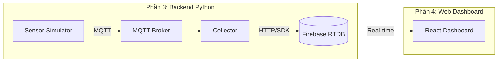

# Hướng Dẫn Vận Hành Hệ Thống RTS - Phần 3 & 4

> **Hệ Thống Báo Cháy Real-Time với Firebase Cloud + Web Dashboard**

---

## 📋 Mục Lục
1. [Tổng Quan Kiến Trúc](#1-tổng-quan-kiến-trúc)
2. [Yêu Cầu Hệ Thống](#2-yêu-cầu-hệ-thống)
3. [Cấu Hình Firebase](#3-cấu-hình-firebase)
4. [Chạy Backend (Collector + Sensor Simulator)](#4-chạy-backend)
5. [Chạy Web Dashboard](#5-chạy-web-dashboard)
6. [Luồng Dữ Liệu Chi Tiết](#6-luồng-dữ-liệu-chi-tiết)
7. [Cấu Trúc Data Firebase](#7-cấu-trúc-data-firebase)
8. [Troubleshooting](#8-troubleshooting)

---

## 1. Tổng Quan Kiến Trúc



**Luồng hoạt động:**
1. **Sensor Simulator** (`sensor_sim.py`): Giả lập ESP32 sensors, gửi dữ liệu qua MQTT
2. **Collector** (`collector_main.py`): Nhận MQTT, xử lý pipeline, ghi lên Firebase
3. **Firebase RTDB**: Cloud database lưu trữ real-time
4. **Web Dashboard**: React app đọc Firebase real-time và hiển thị

---

## 2. Yêu Cầu Hệ Thống

### Python Backend
- **Python**: 3.10+
- **MQTT Broker**: Mosquitto hoặc tương đương
- **Dependencies**: `pip install -r requirements.txt`

### Web Dashboard
- **Node.js**: 18+ (khuyến nghị 20+)
- **npm**: 9+

### Services
- **Firebase Project** với Realtime Database enabled
- **MQTT Broker** chạy local (port 1884 theo config mặc định)

---

## 3. Cấu Hình Firebase

### 3.1 Tạo Firebase Project

1. Truy cập [Firebase Console](https://console.firebase.google.com/)
2. Tạo project mới hoặc sử dụng project hiện có
3. Enable **Realtime Database**:
   - Chọn **Build → Realtime Database → Create Database**
   - Chọn region (khuyến nghị: `asia-southeast1`)
   - Chọn **Start in test mode** (cho development)

### 3.2 Lấy Service Account Key (cho Python Backend)

1. Vào **Project Settings → Service accounts**
2. Click **Generate new private key**
3. Download file JSON
4. Đặt tại: `RTCandDB/secrets/serviceAccountKey.json`

> ⚠️ **Quan trọng**: Thư mục `secrets/` đã được .gitignore, không push lên git!

### 3.3 Lấy Web Config (cho Web Dashboard)

1. Vào **Project Settings → General**
2. Tìm section **Your apps** → **Web app** (tạo nếu chưa có)
3. Copy các giá trị config:

```javascript
const firebaseConfig = {
  apiKey: "AIzaSy...",
  authDomain: "your-project.firebaseapp.com",
  databaseURL: "https://your-project-default-rtdb.asia-southeast1.firebasedatabase.app",
  projectId: "your-project",
  storageBucket: "your-project.appspot.com",
  messagingSenderId: "123456789",
  appId: "1:123456789:web:abc123",
  measurementId: "G-ABCDEF"
};
```

### 3.4 Tạo file .env cho Web Dashboard

Tạo file `web-dashboard/.env`:

```bash
VITE_FB_API_KEY=AIzaSy...
VITE_FB_AUTH_DOMAIN=your-project.firebaseapp.com
VITE_FB_DB_URL=https://your-project-default-rtdb.asia-southeast1.firebasedatabase.app
VITE_FB_PROJECT_ID=your-project
VITE_FB_STORAGE_BUCKET=your-project.appspot.com
VITE_FB_MESSAGING_SENDER_ID=123456789
VITE_FB_APP_ID=1:123456789:web:abc123
VITE_FB_MEASUREMENT_ID=G-ABCDEF
```

### 3.5 Cập nhật Config YAML (cho Python Backend)

Sửa file `configs/baseline.yaml`:

```yaml
rtdb:
  mode: "firebase"  # Đổi từ "mock" → "firebase"
  firebase:
    service_account_json: "secrets/serviceAccountKey.json"
    database_url: "https://your-project-default-rtdb.asia-southeast1.firebasedatabase.app/"
```

---

## 4. Chạy Backend

### 4.1 Cài đặt MQTT Broker

**Windows (Mosquitto):**
```powershell
# Download và cài từ https://mosquitto.org/download/
# Hoặc dùng choco:
choco install mosquitto

# Chạy broker trên port 1884:
mosquitto -p 1884 -v
```

**Docker:**
```bash
docker run -d -p 1884:1883 eclipse-mosquitto
```

### 4.2 Cài đặt Python Dependencies

```powershell
cd d:\Subject\Engineer\RTS\RTCandDB
pip install -r requirements.txt
```

### 4.3 Chạy Collector (Terminal 1)

```powershell
cd d:\Subject\Engineer\RTS\RTCandDB
python -m src.apps.collector_main --config configs/baseline.yaml
```

Collector sẽ:
- Kết nối MQTT broker
- Subscribe các topic: `fire_system/alert`, `fire_system/sensor/data`
- Xử lý pipeline và ghi lên Firebase

### 4.4 Chạy Sensor Simulator (Terminal 2)

```powershell
cd d:\Subject\Engineer\RTS\RTCandDB
python -m src.apps.sensor_sim --config configs/baseline.yaml --duration-s 60
```

**Các tham số quan trọng trong config:**
```yaml
sensor_sim:
  telemetry_rate: 50       # Số message/giây
  alarm_rate: 0.2          # Số alarm/giây
  device_count: 6          # Số ESP32 giả lập (esp32-01 → esp32-06)
  device_id_prefix: "esp32-"
```

---

## 5. Chạy Web Dashboard

### 5.1 Cài đặt Dependencies

```powershell
cd d:\Subject\Engineer\RTS\RTCandDB\web-dashboard
npm install
```

### 5.2 Tạo file .env (nếu chưa có)

Xem [3.4 Tạo file .env](#34-tạo-file-env-cho-web-dashboard)

### 5.3 Khởi chạy Development Server

```powershell
npm run dev
```

Dashboard sẽ chạy tại: **http://localhost:5173/**

### 5.4 Build Production

```powershell
npm run build
npm run preview  # Preview production build
```

---

## 6. Luồng Dữ Liệu Chi Tiết

### 6.1 Sensor Simulator → MQTT

```python
# sensor_sim.py gửi payload như sau:
payload = {
    "msg_id": "uuid-xxx",
    "device_id": "esp32-01",
    "type": "telemetry",  # hoặc "alarm"
    "t_sensor_ms": 1706456789000,  # timestamp
    "seq": 1,
    "values": {
        "temp": 25.5,    # Nhiệt độ
        "smoke": 0.3,    # Khói (0-1)
        "gas": 0.2,      # Gas (0-1)
        "flame": 0.0     # Lửa (0 hoặc 1)
    }
}
```

### 6.2 Collector → Firebase

**Collector ghi 3 loại data lên Firebase:**

```python
# 1. State (trạng thái hiện tại của device)
/devices/{device_id}/state = {
    "ts_ms": 1706456789000,
    "severity": "OK",  # OK, WARN, ALARM
    "values": {...},
    "avi_ms": 2000,
    "src": "sim"
}

# 2. Alarm (khi có cảnh báo)
/alarms/{alarm_id} = {
    "deviceId": "esp32-01",
    "ts_ms": 1706456789000,
    "severity": "ALARM",
    "values": {...},
    "ack": false,
    "note": ""
}

# 3. Telemetry (lịch sử đo)
/telemetry/{device_id}/{push_id} = {
    "ts_ms": 1706456789000,
    "values": {...}
}
```

### 6.3 Firebase → Web Dashboard

**Dashboard sử dụng hook `useRtdbValue` để đọc real-time:**

```typescript
// Đọc toàn bộ devices
const { value: devices } = useRtdbValue<DevicesTree>("devices", {});

// Đọc danh sách alarms
const { value: alarms } = useRtdbList("alarms", 100, { field: "ts_ms" });
```

---

## 7. Cấu Trúc Data Firebase

```
Firebase Realtime Database
├── devices/
│   ├── esp32-01/
│   │   └── state/
│   │       ├── ts_ms: 1706456789000
│   │       ├── severity: "OK"
│   │       ├── values: {temp, smoke, gas, flame}
│   │       └── src: "sim"
│   ├── esp32-02/
│   │   └── state/...
│   └── esp32-06/
│       └── state/...
│
├── alarms/
│   ├── {alarm_id_1}/
│   │   ├── deviceId: "esp32-03"
│   │   ├── ts_ms: 1706456789000
│   │   ├── severity: "ALARM"
│   │   ├── values: {...}
│   │   ├── ack: false
│   │   └── note: ""
│   └── {alarm_id_2}/...
│
├── telemetry/
│   ├── esp32-01/
│   │   ├── {push_id_1}: {ts_ms, values}
│   │   └── {push_id_2}: {ts_ms, values}
│   └── ...
│
└── config/
    └── thresholds/
        ├── temp: 60
        ├── smoke: 0.7
        └── gas: 0.8
```

---

## 8. Troubleshooting

### Dashboard hiển thị "Thiếu Firebase Config"
- Kiểm tra file `web-dashboard/.env` có đầy đủ các biến VITE_FB_*
- Restart dev server sau khi tạo/sửa .env

### Dữ liệu không lên Firebase
- Kiểm tra MQTT broker có chạy không
- Kiểm tra `configs/baseline.yaml` có `rtdb.mode: "firebase"`
- Kiểm tra file `secrets/serviceAccountKey.json` tồn tại

### Dashboard không nhận real-time
- Mở Console (F12) kiểm tra lỗi Firebase
- Kiểm tra Firebase Rules cho phép read/write

### MQTT connection refused
- Kiểm tra port MQTT (default: 1884)
- Sửa `mqtt.port` trong config nếu cần

---

## 🔗 Links Quan Trọng

| Tài nguyên | Đường dẫn |
|------------|-----------|
| Firebase Console | https://console.firebase.google.com/ |
| Config mặc định | `configs/baseline.yaml` |
| Firebase credentials | `secrets/serviceAccountKey.json` |
| Dashboard env | `web-dashboard/.env` |
| Main collector | `src/apps/collector_main.py` |
| Sensor simulator | `src/apps/sensor_sim.py` |
| Firebase hook | `web-dashboard/src/hooks/useRtdbValue.ts` |
| Building config | `web-dashboard/src/config/building.ts` |

---

## ✅ Checklist Khởi Chạy Nhanh

1. [ ] MQTT Broker chạy trên port 1884
2. [ ] File `secrets/serviceAccountKey.json` có sẵn
3. [ ] `configs/baseline.yaml` đã set `rtdb.mode: "firebase"`
4. [ ] File `web-dashboard/.env` có đầy đủ config
5. [ ] Terminal 1: `python -m src.apps.collector_main --config configs/baseline.yaml`
6. [ ] Terminal 2: `python -m src.apps.sensor_sim --config configs/baseline.yaml`
7. [ ] Terminal 3: `cd web-dashboard && npm run dev`
8. [ ] Mở browser: http://localhost:5173/
